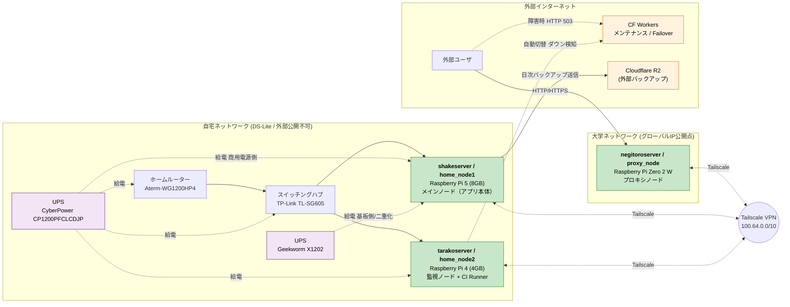
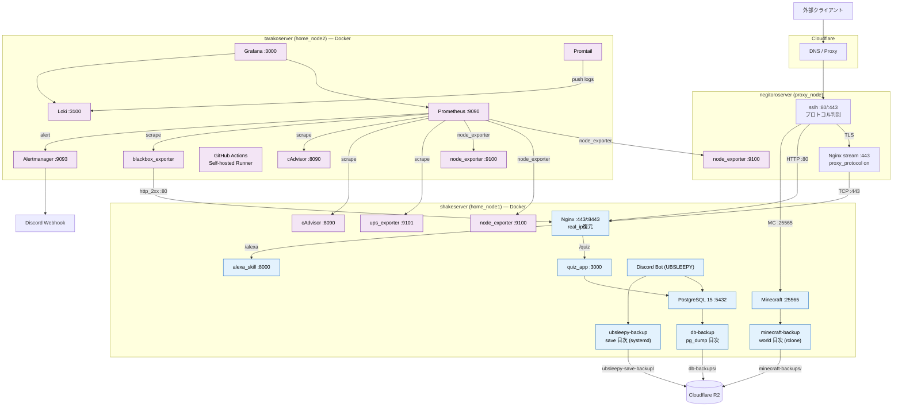

# 0. システム構成図（物理 / 論理）

shake 基盤の全体像を「物理構成」と「論理構成」の2つの視点で示す。

- **物理構成図**: どの機材が・どの拠点に・どう接続されているか
- **論理構成図**: リクエストがどう流れ、各ポート/コンテナがどう連携するか

図は Git 管理しやすい Mermaid で記述している。本ファイルは GitHub 上でそのまま描画される。
見栄えを優先した [D2](https://d2lang.com/) 版のソースも [diagrams/](diagrams/) に併置している（描画方法は末尾参照）。

---

## 0.1 物理構成図（ノード・拠点・ネットワーク）



自宅にグローバル IP を晒さず、大学拠点の Pi Zero 2 W を公開ゲートウェイにし、3 台を
Tailscale メッシュ VPN（ポート開放不要・WireGuard ベース）で接続している。
詳細は [02_ネットワーク基盤.md](02_ネットワーク基盤.md) を参照。

---

## 0.2 論理構成図（トラフィック・サービス・データフロー）



443 番一本に HTTPS と Minecraft を多重化（sslh → Nginx stream → Proxy Protocol で実 IP 復元）。
内部サービス（5432/3000/9090 等）はすべて Tailscale + 緊急 LAN からのみ到達可能で、
外部公開は proxy_node の 80/443 だけ。UFW の IP 戦略は [02_ネットワーク基盤.md](02_ネットワーク基盤.md)、
監視データフローは [04_監視・ログ・通知基盤.md](04_監視・ログ・通知基盤.md) を参照。

---

## 0.3 D2 版

[D2](https://d2lang.com/) で記述したソースから生成した SVG を以下に埋め込んでいる。

### 物理構成図（D2）


### 論理構成図（D2）


### 再生成方法
ソースは [diagrams/physical.d2](diagrams/physical.d2) / [diagrams/logical.d2](diagrams/logical.d2)。

```bash
# インストール (一度だけ)
curl -fsSL https://d2lang.com/install.sh | sh -s --

# 描画 (SVG 出力)
d2 docs/diagrams/physical.d2 docs/diagrams/physical.svg
d2 docs/diagrams/logical.d2  docs/diagrams/logical.svg

# 編集しながらブラウザでライブプレビュー
d2 --watch docs/diagrams/physical.d2
```

> PNG で書き出す場合（`d2 physical.d2 physical.png`）は headless Chromium が必要。
> SVG はベクタ形式で GitHub 上でもそのまま表示されるため、通常は SVG 出力で十分。
